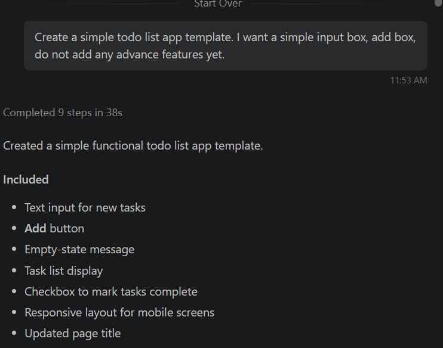
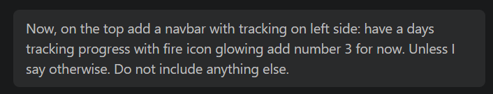
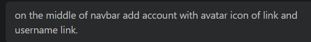
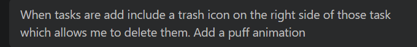
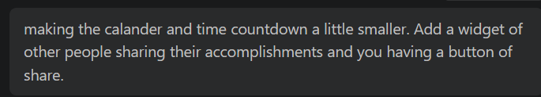
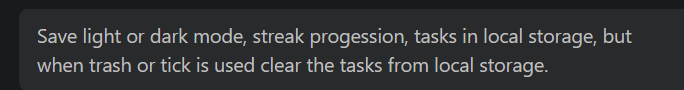

1. What did you ask Copilot to build?
- I asked Copilot to start with a simple todo list app template with no advance features. 

2. How did you break the project into smaller pieces?
- I broke the project into different features such as starting with input box and add button, then navbar having progression graph, avatar, and calander countdown. I then followed up with account informations. The added other animations for task completions. Finally, added the light and dark mode and saved all of the user choice in local storage.

3. How did your prompts/questions change as you worked?
- The prompts kept on going more in detail as I progressed through the project. I had to add more information while limiting its ability to not go more advance than needed.

4. What surprised you about using Copilot?
- I was surprised by how fast it works. If I hadnt been using local agent for the first few progress of my projects until I had to start over again after switching to copilot then I could have complete this even quicker. 
But the way it worked was so satisfying. Just typing up what I wanted and the next thing it pops up within the application is amazing.

5. What did you learn about the technology?
- I learned how to switch multiple agents. I learned how to prompt engineer and also learned how effiecent this makes coding. This was a very interesting project and even if I didn't code it. I believe asking the correct way is still important and might be the next way of coding in the future.

6. What would you do differently next time?
- The first thing I would do differently would be to change the local to copilot so that I don't have to keep doing the task over an over again. The second thing I would do is actually use the right windows for chat rather than CTRL + I because I couldn't find the chat history when I used that. 
- Other than than, I would actually focue on my prompt engineering skills to use less tokens and energy while getting the most efficient code.
